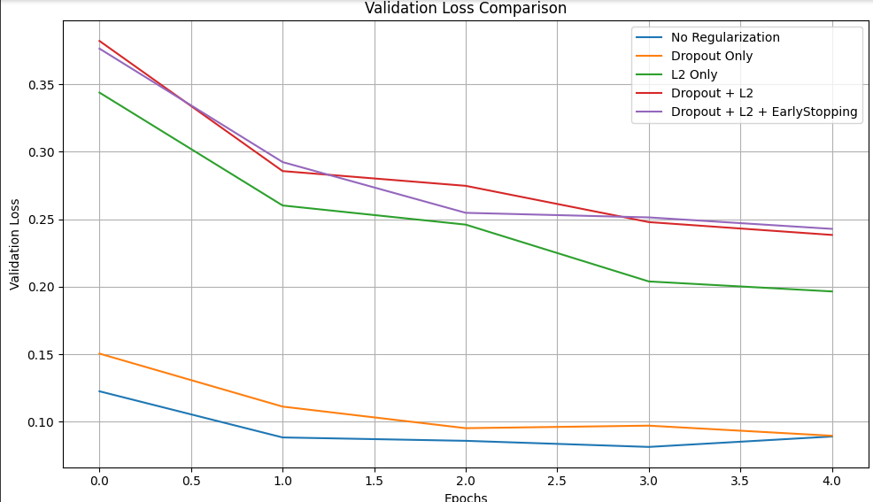

# AI Engineer Portfolio Project: Comparing Regularization Techniques

This project is part of an AI Engineer's portfolio to demonstrate a practical comparison of different regularization techniques using a neural network on the MNIST dataset.

## 📌 Techniques Covered

- Dropout
- L2 Regularization
- Early Stopping

## 📊 Dataset

We use the classic **MNIST** dataset of handwritten digits (28x28 grayscale images of digits 0-9).

## 🧠 Model Architecture

Each model has the following structure:

- Dense Layer (256 units, ReLU, optional L2)
- Optional Dropout Layer
- Dense Layer (128 units, ReLU, optional L2)
- Optional Dropout Layer
- Dense Output Layer (10 units, Softmax)

## 🛠️ Regularization Configurations

The following configurations are tested:

1. **No Regularization**
2. **Dropout Only**
3. **L2 Regularization Only**
4. **Dropout + L2**
5. **Dropout + L2 + EarlyStopping**

## 🚀 Training & Evaluation

- **Optimizer:** Adam
- **Loss Function:** Sparse Categorical Crossentropy
- **Validation Split:** 20%
- **Epochs:** 5
- **Batch Size:** 64

Each model is trained and evaluated on the test set to compare validation losses and final accuracies.

## 📈 Visualization

Validation losses across all models are plotted for a visual comparison.

## 🧪 Final Output

Prints test accuracy of each model and plots validation loss curves.

## 📁 How to Run

```bash
pip install tensorflow matplotlib tqdm
python regularization_comparison.py
```

## 📷 Output

```text
Test Accuracies:
No Regularization: 0.9783
Dropout Only: 0.9769
L2 Only: 0.9733
Dropout + L2: 0.9688
Dropout + L2 + EarlyStopping: 0.9696
```

And a plot showing validation loss over epochs.


## 📚 Learnings

This experiment highlights how each regularization technique helps improve generalization and performance on unseen data.

## 👨‍💻 Author

Muzammil Sohail – AI Engineer  
GitHub: [https://github.com/muzammil7866]

## 📝 License

This project is open-source and available under the MIT License.
